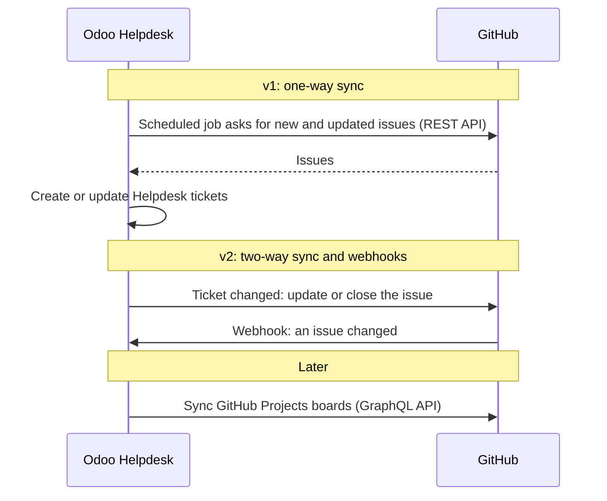

# How Odoo and GitHub talk

```mermaid
sequenceDiagram
    participant O as Odoo Helpdesk
    participant G as GitHub

    Note over O,G: v1: one-way sync
    O->>G: Scheduled job asks for new and updated issues (REST API)
    G-->>O: Issues
    O->>O: Create or update Helpdesk tickets

    Note over O,G: v2: two-way sync and webhooks
    O->>G: Ticket changed: update or close the issue
    G->>O: Webhook: an issue changed

    Note over O,G: Later
    O->>G: Sync GitHub Projects boards (GraphQL API)
```
